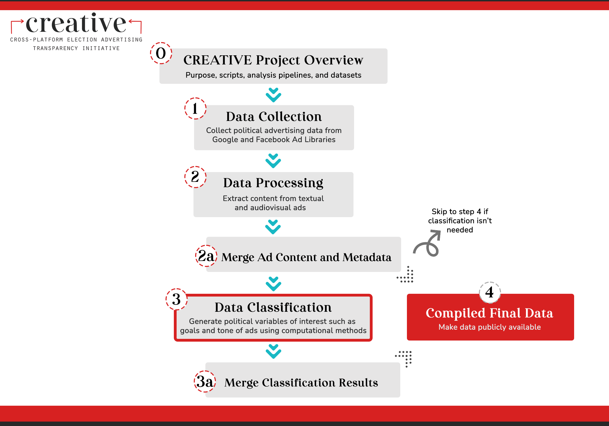

# CREATIVE --- Ad Goal Classifier

Welcome! This repo contains scripts for training a machine learning model for political ad goal classification (e.g., donate, contact, or get-out-the-vote, etc.).

This repo is part of the [Cross-platform Election Advertising Transparency Initiative (CREATIVE)](https://www.creativewmp.com/). CREATIVE is an academic research project that has the goal of providing the public with analysis tools for more transparency of political ads across online platforms. In particular, CREATIVE provides cross-platform integration and standardization of political ads collected from Google and Facebook. CREATIVE is a joint project of the [Wesleyan Media Project (WMP)](https://mediaproject.wesleyan.edu/) and the [privacy-tech-lab](https://privacytechlab.org/) at [Wesleyan University](https://www.wesleyan.edu).

To analyze the different dimensions of political ad transparency we have developed an analysis pipeline. The scripts in this repo are part of the Data Classification step in our pipeline.



## Table of Contents

- [1. Overview](#1-overview)
- [2. Setup](#2-setup)
- [3. Results Storage](#3-results-storage)
- [4. Training Data](#4-training-data)
- [5. Thank You](#5-thank-you)

## 1. Overview

In this repo, we classify ads into the following nine category of goals: 
- Donate: Request for donations
- Contact: Request for viewer to contact with lawmakers
- Purchase: Selling of merchandise
- Get-out-the-vote (GOTV): Get out to vote efforts
- Event: Advertisement of an event
- Poll: Ask viewer to fill a poll
- Gather info: Solicitation of viewers' information
- Learn more: Invite viewer to learn more about a candidate
- Persuade: Persuade the viewer to vote

The model is trained on hand-coded 2020 Facebook data labeled by the WMP.

## 2. Setup

This repo contains eight R scripts and eight Python scripts that are of interest. The scripts are numbered in the order in which they should be run. Scripts that directly depend on one another are ordered sequentially. Scripts with the same number are alternatives, usually they are the same scripts to be run on different data or with minor variations. The outputs of each script are saved, so it is possible to, for example, only run the inference script, since the model files are already present. There are also some additional scripts present, which will be discussed in the setup section.

For an example pipeline, training on 2020 Facebook, and then doing inference on 2022 Facebook data, see `pipeline_2022.sh`. This task should take about 20 minutes to run on a laptop.

### 2.1 Install R and Packages

To run the scripts in this repo install R and the scripts required packages:

1. First, make sure you have R installed. While R can be run from the terminal, many people find it easier to use RStudio along with R. Here is a [tutorial for setting up R and RStudio](https://rstudio-education.github.io/hopr/starting.html). These scripts have been tested with R 4.1, 4.2, 4.3, and 4.4.

3. Next, make sure you have the following packages installed in R (the exact version we used of each package is listed in the [requirements_r.txt file](https://github.com/Wesleyan-Media-Project/ad_goal_classifier/blob/main/requirements_r.txt). These are the versions we tested our scripts on. Thus, scripts might also work with other versions but not tested). You can the packages install by calling:

   ```R
   install.packages('data.table')
   install.packages("stringr")
   install.packages("stringi")
   install.packages("dplyr")
   install.packages("tidyr")
   ```

4. In order to successfully run each R script you must first set your working directory. The working directory is the location on your computer that R will use for reading and writing files. You can do so by adding the line `setwd("your/working/directory")` to the top of the R scripts, replacing `"your/working/directory"` with your actual working directory. You must make sure that your working directory is in agreement with the paths to where any input files exist and where output files will be created.

   For instance, in script `01_prepare_fbel.R` the input and output are written as follows:

   ```R
   # Input data
   path_input_data <- "data/fbel_w_train.csv"
   # Output data
   path_output_data <- "data/fbel_prepared.csv"
   ```

   If you do not wish to change either of these paths, your working directory should be set as follows:

   ```R
   setwd("/local/path/to/ad_goal_classifier/")
   ```

   where `/local/path/to/` represents the location at which the ad_goal_classifier folder resides on your computer.

### 2.2 Install Python and Packages

1. First, make sure you have [Python](https://www.python.org/) installed. The scripts have been tested with Python 3.9, and 3.10. 

2. In addition, make sure you have the following packages installed in Python (the exact version we used of each package is listed in the [requirements_py.txt file](https://github.com/Wesleyan-Media-Project/ad_goal_classifier/blob/main/requirements_py.txt). These are the versions we tested our scripts on. Thus, scripts might also work with other versions but not tested). You can install by running the following in your command-line:

   ```bash
   pip install pandas
   pip install scikit-learn
   pip install numpy
   pip install joblib
   pip install tqdm
   ```

**NOTE**: As the scripts have been tested with the package versions provided in [requirements_py.txt](https://github.com/Wesleyan-Media-Project/ad_goal_classifier/blob/main/requirements_py.txt) and [requirements_r.txt](https://github.com/Wesleyan-Media-Project/ad_goal_classifier/blob/main/requirements_r.txt), we recommend using those same versions in order to avoid potential errors.

### 2.3 Download Input Files

**NOTE**: Some parts of the data in the datasets repo include TV data. Due to contractual reasons, users must apply directly to receive raw TV data. Visit <http://mediaproject.wesleyan.edu/dataaccess/> and fill out the online request form for accessing TV data.

For inference scripts, you will need to download the following input files from Figshare:

- For Facebook 2022 [04_prepare_fb2022.R](https://github.com/Wesleyan-Media-Project/ad_goal_classifier/blob/main/04_prepare_fb2022.R): [fb_2022_adid_text.csv.gz](https://figshare.wesleyan.edu/account/articles/26124295)
- For Google 2022 [04_prepare_google_2022.R](https://github.com/Wesleyan-Media-Project/ad_goal_classifier/blob/main/04_prepare_google_2022.R): [g2022_adid_01062021_11082022_text.csv.gz](https://figshare.wesleyan.edu/account/articles/26124343)

Legacy (non-2022) data production: 
- For Facebook 2020 [04_prepare_140m.R](https://github.com/Wesleyan-Media-Project/ad_goal_classifier/blob/main/04_prepare_140m.R): [fb_2020_140m_adid_text_clean.csv.gz](https://figshare.wesleyan.edu/account/articles/26093257)
- For Google 2020 [04_prepare_google_2020.R](https://github.com/Wesleyan-Media-Project/ad_goal_classifier/blob/main/04_prepare_google_2020.R): google_2020/google_2020_adid_text_clean.csv.gz (ADD FIGSHARE LINK ONCE READY)

### 2.4 Run Scripts

#### 2.4.1 Training

**NOTE**: If you do not want to train the models from scratch, you can use the trained models we provide [here](https://github.com/Wesleyan-Media-Project/ad_goal_classifier/tree/main/models) and skip to 2.4.2.

To run the inference scripts, you first need to train a machine learning classification model. The training data is the FBEL dataset, located [here](https://github.com/Wesleyan-Media-Project/ad_goal_classifier/blob/main/data/fbel_w_train.csv). Here is the [codebook](https://drive.google.com/drive/folders/1gx1hDxEON_ck_i49nhbFpGXFCRbCU5bM?usp=share_link) of the dataset.

We prepare the training data which is then trained on a Random Forest Classification model (80/20 train/test split). First, run [`01_prepare_fbel.R`](https://github.com/Wesleyan-Media-Project/ad_goal_classifier/blob/main/01_prepare_fbel.R) and [`02_create_training_data.py`](https://github.com/Wesleyan-Media-Project/ad_goal_classifier/blob/main/02_create_training_data.py) to prepare training data. Second, run script [`03_binomial_goal_clf_train.py`](https://github.com/Wesleyan-Media-Project/ad_goal_classifier/blob/main/03_binomial_goal_clf_train.py) to train the model on the training set, and also record performance on the test set. Performance scores for each goal are saved in [`performance/rf/`](https://github.com/Wesleyan-Media-Project/ad_goal_classifier/tree/main/performance/rf). Note that we train nine different binary classification models, one for each goal category.

#### 2.4.2 Inference

In order to execute a Python script you can run the following command from your terminal from within the directory of the script replacing `file.py` with the file name of the script you want to run:

```bash
python3 file.py
```

In order to execute an R script you can run the following command from your terminal from within the directory of the script replacing `file.R` with the file name of the script you want to run:

```bash
Rscript file.R
```

The scripts that begin with 04 are all alternatives of each other, with each one preparing a different dataset so that it is in the same shape as the training data. Here is a list of scripts and any input file you will need:

- For Facebook 2022 [04_prepare_fb2022.R](https://github.com/Wesleyan-Media-Project/ad_goal_classifier/blob/main/04_prepare_fb2022.R): fb_2022_adid_text.csv.gz (ADD FIGSHARE LINK ONCE READY)
- For Google 2022 [04_prepare_google_2022.R](https://github.com/Wesleyan-Media-Project/ad_goal_classifier/blob/main/04_prepare_google_2022.R): g2022_adid_01062021_11082022_text.csv.gz (ADD FIGSHARE LINK ONCE READY)

Legacy, non-2022 data: 
- For Facebook 2020 [04_prepare_140m.R](https://github.com/Wesleyan-Media-Project/ad_goal_classifier/blob/main/04_prepare_140m.R): fb_2020/fb_2020_140m_adid_text_clean.csv.gz (ADD FIGSHARE LINK ONCE READY)
- For Google 2020 [04_prepare_google_2020.R](https://github.com/Wesleyan-Media-Project/ad_goal_classifier/blob/main/04_prepare_google_2020.R): google_2020/google_2020_adid_text_clean.csv.gz (ADD FIGSHARE LINK ONCE READY)

The scripts that begin with 05 are also all alternatives of each other, with each one running inference on a different dataset.

For the scripts that begin with 04 and 05, inferencing which dataset they are being run on can be done from looking at the end of their names. For example, `05_binomial_goal_clf_inference_google_2022.py` is inference on the `data-post-production/google_2022 dataset`. In addition, this information can be seen when looking at the scripts' input data, which will include a path to the dataset they are referencing.

Scripts beginning with 06 and 07 test whether the model trained on only Facebook ads can also be applied to TV ads. It does so by applying the models to 2020 TV ads labeled by WMP.

Scripts beginning with 11 and 12 are inference scripts for 2020 Facebook and Google electoral candidate ads only.

Scripts beginning with 99 use Facebook's regional distribution to determine the proportion of an ad's monetary spend that goes into an electoral candidate's own state. This information is intended to be used together with the goal classifier to determine, for example, what proportion of donate ads are aimed outside of the candidate's state.

## 3. Results Storage

The output data for the scripts in this repo is in `.csv` format – the name and location of each output file is specified in the script that creates it. For example, the output data for [`05_binomial_goal_clf_inference_fb_2022.py`](https://github.com/Wesleyan-Media-Project/ad_goal_classifier/blob/main/05_binomial_goal_clf_inference_fb_2022.py) is stored at [`data/ad_goal_rf_fb2022.csv.gz`](https://github.com/Wesleyan-Media-Project/ad_goal_classifier/blob/main/data/ad_goal_rf_fb2022.csv.gz).

## 4. Thank You

<p align="center"><strong>We would like to thank our supporters!</strong></p><br>

<p align="center">This material is based upon work supported by the National Science Foundation under Grant Numbers 2235006, 2235007, and 2235008.</p>

<p align="center" style="display: flex; justify-content: center; align-items: center;">
  <a href="https://www.nsf.gov/awardsearch/showAward?AWD_ID=2235006">
    
  </a>
</p>

<p align="center">The Cross-Platform Election Advertising Transparency Initiative (CREATIVE) is a joint infrastructure project of the Wesleyan Media Project and privacy-tech-lab at Wesleyan University in Connecticut.

<p align="center" style="display: flex; justify-content: center; align-items: center;">
  <a href="https://www.creativewmp.com/">
    
  </a>
</p>

<p align="center" style="display: flex; justify-content: center; align-items: center;">
  <a href="https://mediaproject.wesleyan.edu/">
    
  </a>
</p>

<p align="center" style="display: flex; justify-content: center; align-items: center;">
  <a href="https://privacytechlab.org/" style="margin-right: 20px;">
    
  </a>
</p>
